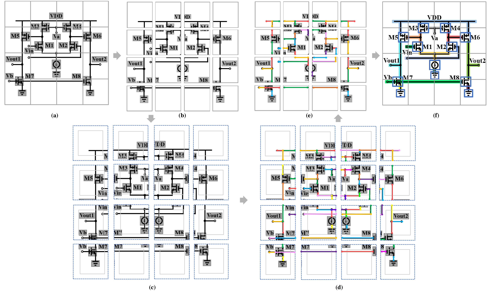

# Netlistify
Netlistify is a deep learning-based framework designed to convert schematic images into HSPICE netlists. We provide an code package for line detection (based on a modified [DETR](https://github.com/facebookresearch/detr) Transformer model), which outputs the precise locations of wire segments within a schematic. Users can combine the wire segment positions extracted by the Transformer model with component locations from YOLO and orientation information from ResNet to reconstruct the netlist. This modular approach ensures accurate schematic interpretation by combining deep learning techniques for different subtasks.


## Prerequisites

- Python 3.10.14: [Download and install Python 3.10.14] for your operating system.

## Installation
1. Navigate to the project directory:
2. Install the project dependencies:

    ```shell
    pip install -r requirements.txt
    ```

## Usage
To run the `main.py` script to train, execute the following command:
    
    python main.py

## Adjusting Training Parameters
You can modify training parameters (e.g., learning rate, batch size, number of epochs) in `main_config.py` before running the script.

## Output file
The weights of the model will be saved to "runs/FormalDataset"

## Inference
1. Select the trained weights in `main_config.py`:
Open `main_config.py` and set the path to the trained model weights.

2. Refer to `testing.py` for an example implementation of how to use the trained model for line detection.
You can follow the function calls in `testing.py` to integrate inference.

## Dataset
Our dataset contains 100,000 schematic images, designed to train and evaluate deep learning models for schematic interpretation. 
The dataset used in this project is available on [Hugging Face:Schematic images](https://huggingface.co/datasets/hanky2397/schematic_images). 

Note: The dataset is provided in .zip format. Users need to manually download and extract it before use.
