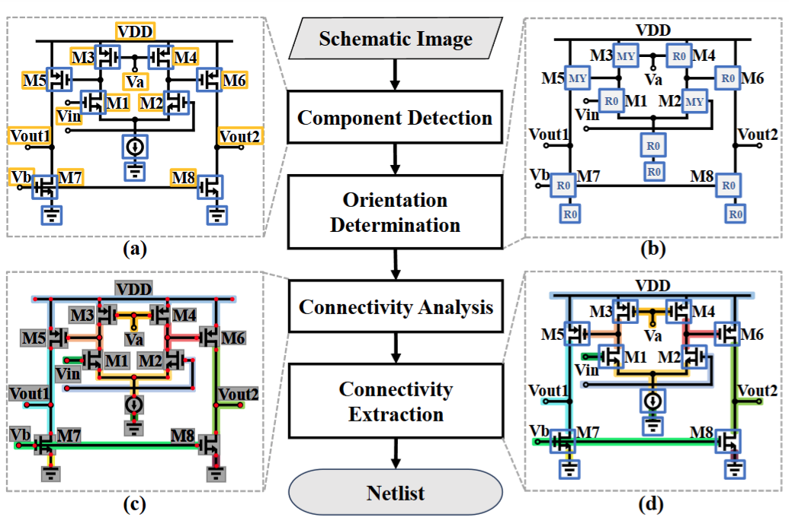

# Netlistify

Netlistify is a modular deep learning framework for converting analog and mixed-signal (AMS) circuit schematics into HSPICE-compatible netlists. It integrates YOLOv8 for component detection, ResNet for orientation classification, and a modified [DETR](https://github.com/facebookresearch/detr) Transformer for precise wire detection and connectivity analysis. With provided preprocessing scripts, synthetic datasets, and pre-trained models, Netlistify enables accurate, end-to-end schematic interpretation and netlist reconstruction out-of-the-box.



## Publications
- Chun-Yen Huang, Hsuan-I Chen, Hao-Wen Ho, Pei-Hsin Kang, Mark Po-Hung Lin, Wen-Hao Liu, Haoxing Ren, “Netlistify: Transforming Circuit Schematics into Netlists with Deep Learning“, ACM/IEEE International Symposium on Machine Learning for CAD (MLCAD), Santa Cruz, CA, September 8–10, 2025

## Prerequisites

- Python 3.10.14: [Download and install Python 3.10.14] for your operating system.

## Installation
1. Navigate to the project directory:
2. Install the project dependencies:

    ```shell
    pip install -r requirements.txt
    ```

## Usage
To run the `main.py` script to train, execute the following command:

    python main.py

## Adjusting Training Parameters
You can modify training parameters (e.g., learning rate, batch size, number of epochs) in `main_config.py` before running the script.

## Output file
The weights of the model will be saved to "runs/FormalDataset"

## Inference
1. Select the trained weights in `main_config.py`:
Open `main_config.py` and set the path to the trained model weights.

2. Refer to `testing.py` for an example implementation of how to use the trained model for line detection.
You can follow the function calls in `testing.py` to integrate inference.

## ⭐ Inference Out-of-the-Box (using pretrained model)
If you want to run inference out-of-the-box without training:

1.	Download the pretrained model from the provided [Pretrained Model](https://drive.google.com/file/d/1Jlx9HNfrTIXrjIOyIL3zyy_rDrcfKKzZ/view?usp=sharing).
2.	Place the weights into the directory specified in main_config.py.
3.	Run:

        python inference.py

This will execute the full inference pipeline using the pretrained model.

## Dataset
Our dataset contains 100,000 schematic images, designed to train and evaluate deep learning models for schematic interpretation.
The dataset used in this project is available on [Hugging Face:Schematic images](https://huggingface.co/datasets/hanky2397/schematic_images).

Note: The dataset is provided in .zip format. Users need to manually download and extract it before use.

## Acknowledgments
The authors would like to express their sincere gratitude to NVIDIA, Inc., and to the National Science and Technology Council (NSTC) of Taiwan, under Grant No. NSTC 111-2221-E-A49-137-MY3, for their generous support of this research.

## Contributors
| Name | Affiliation | profile |
|---|---|---|
| Chun-Yen Huang | NYCU | |
| Hsuan-I Chen | NYCU | |
| Hao-Wen Ho | NYCU | |
| Pei-Hsin Kang | NYCU | |
| Mark Po-Hung Lin | NYCU | |
| Wen-Hao Liu | NVIDIA Research | [link](https://research.nvidia.com/person/wen-hao-liu) |
| Haoyu Yang | NVIDIA Research | [link](https://research.nvidia.com/person/haoyu-yang) |
| Haoxing Ren | NVIDIA Research | [link](https://research.nvidia.com/person/haoxing-mark-ren) |

## Contact

For technical questions, please contact hank2397.ai11@nycu.edu.tw or deathate.ai12@nycu.edu.tw
